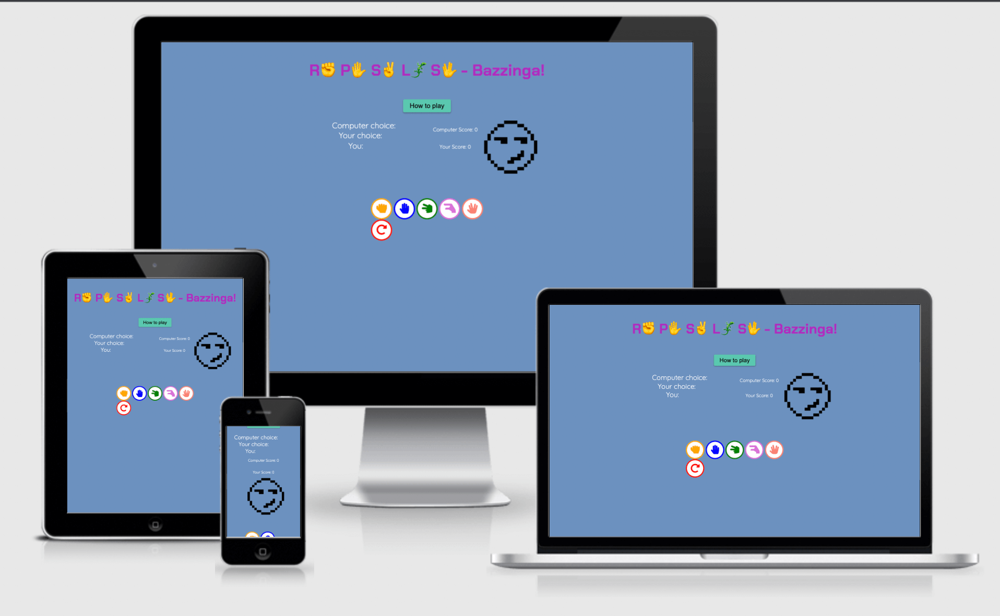
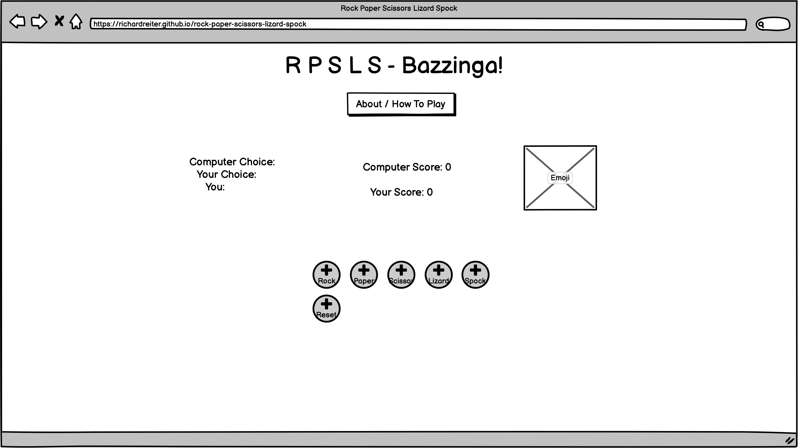
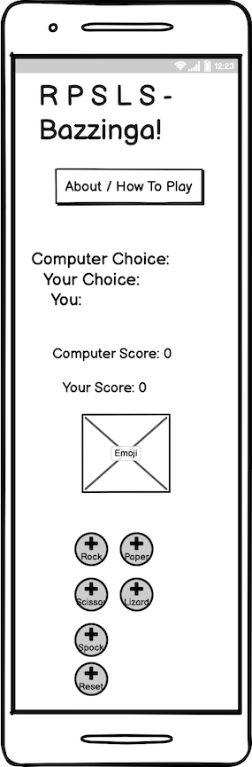
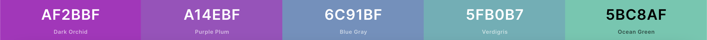
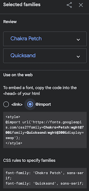

# Rock, Paper, Scissors, Lizard, Spock Game

[Rock Paper Scissors Lizard Spock](https://richardreiter.github.io/rock-paper-scissors-lizard-spock/) is a website hosting a web based game invented by [Sam Kass & Karen Bryla](http://www.samkass.com/theories/RPSSL.html). This game was popularised by the American TV sitcom [The Big Bang Theory](https://youtu.be/x5Q6-wMx-K8), as an improvement of the classic Rock Paper Scissors game.
The Lizard and Spock addition is meant to give the game a twist and make it more fun/exciting.

The player will test their luck against the computer, making a choice of their weapon in each round - Try and beat the computer, first to reach 5 points wins!

Visit the live project [here.](https://richardreiter.github.io/rock-paper-scissors-lizard-spock/)

## UX (User Experience)

### Project Goals

- Create a clean, simple one page website to showcase a classic fun game (with a twist).
- Provide the user/player with instructions/rules on how to play the game.
- Provide feedback to the user on each round via a score tally.

### Target Audience

- People of all ages.
- Anyone who wants to have a bit of fun with a game of chance.

### User Stories

- As a user, I want to understand what the website is about.
- As a user, I want to know how to play the game.
- As a user, I want to know the game's rules.

### Wireframes

The mockups below were done with the help of Balsamiq (for both desktop and mobile screens), these were useful to help visualise the project.

- Desktop:
  

- Mobile:
  

### Design

- The colour scheme was generated with [Coolors.](https://coolors.co/af2bbf-a14ebf-6c91bf-5fb0b7-5bc8af)

- [Google Fonts](https://fonts.google.com/) was used for the website's fonts, some inspiration on the choice of fonts (Chakra Petch & Quicksand) came from [mixed ideas of this blog post](https://artisanthemes.io/best-google-fonts-combinations-modern-agency-website/) and also [this site](https://www.whatfontis.com/NMY_BigBang.similar).

## Features

### Existing Features

- 

### Features Left to Implement

- 

## Technologies Used

- [HTML5](https://developer.mozilla.org/en-US/docs/Glossary/HTML5)
- [CSS3](https://developer.mozilla.org/en-US/docs/Web/CSS)
- [JavaScript](https://developer.mozilla.org/en-US/docs/Web/JavaScript)

### Languages Used

- 

### Frameworks, Libraries & Programs Used

- 

## Testing

### Testing User Stories from User Experience (UX) Section

- 

### Validator Testing

- 

### Google Lighthouse

- 

### Color Contrast Accessibility Checker

- 

### Responsive Testing

- 

### Device Testing

- 
  - 

### Browser Testing

- 

### Fixed Bugs

- 

## Deployment

- 

## Credits 

### Content

- 

### Media

- 

### Other

- Many thanks to my mentor, Gerry McBride, for his guidance and feedback.